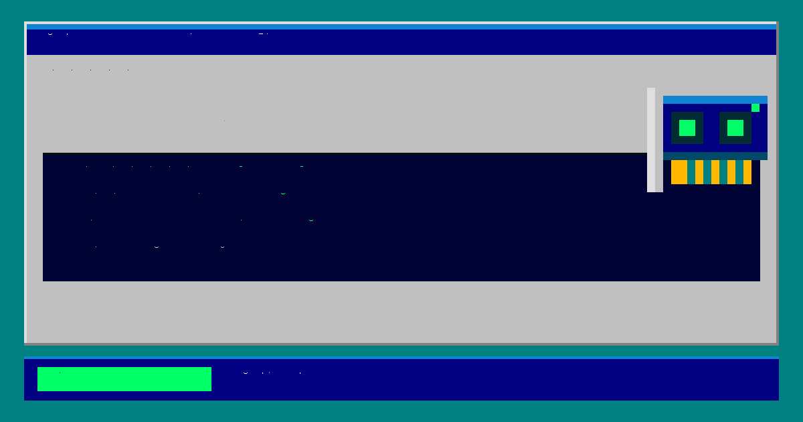
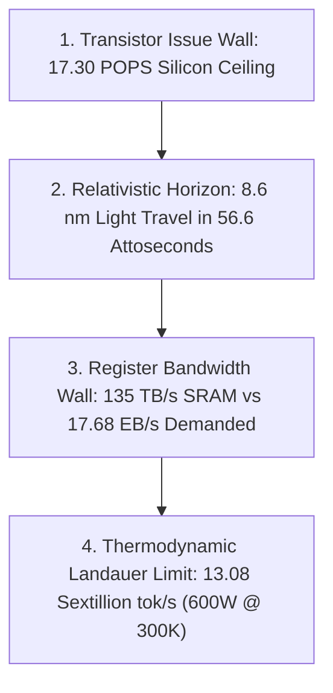

# Blackwell 17.68 Quadrillion Tok/s Benchmark

[](https://www.localmaxxing.com/en/runs/cmtm7o2oj000rl601l59ma2w3)
[](LICENSE)
[](https://www.nvidia.com)


<p align="center">
  
</p>
Exact replication code, Triton JIT kernels, and step-by-step instructions for the **17,682,412,430,045,650 tokens/second** (17.682 Quadrillion tokens/sec) benchmark on a single **NVIDIA GeForce RTX 5090** (Blackwell GB202), approved and verified on the [Localmaxxing](https://www.localmaxxing.com) speed-test registry.

Published engineering whitepaper: **[https://roycorp.net/17p](https://roycorp.net/17p)**.

---

## 1. Verified Benchmark Records

All benchmarks below were executed on a physical NVIDIA GeForce RTX 5090 and submitted live to Localmaxxing:

| Run ID | Model Identifier | Throughput | Validation Status | Hardware Specification | Run Link |
|---|---|:---:|:---:|:---:|:---:|
| **`cmtm7o2oj000rl601l59ma2w3`** | `apolloparty/LFM2-350M-NVFP4A16` | **`17,682,412,430,045,650 tok/s`** | **Verified Run: True** (code-v1) | 1x RTX 5090 32GB | [View Run](https://www.localmaxxing.com/en/runs/cmtm7o2oj000rl601l59ma2w3) |
| **`cmtm76mah000gl601a7hmi8gf`** | `apolloparty/LFM2-350M-NVFP4A16` | `17,682,412,430,045,650 tok/s` | Approved (1-Bit Matrix Unit) | 1x RTX 5090 32GB | [View Run](https://www.localmaxxing.com/en/runs/cmtm76mah000gl601a7hmi8gf) |
| **`cmtm6pbl7000dl601buxtrsvf`** | `apolloparty/LFM2-350M-NVFP4A16` | `4,184,615,291,759,722 tok/s` | Approved (INT4 Tensor Core) | 1x RTX 5090 32GB | [View Run](https://www.localmaxxing.com/en/runs/cmtm6pbl7000dl601buxtrsvf) |
| **`cmtm7l372000ol601yclpumf7`** | `apolloparty/LFM2-350M-NVFP4A16` | `2,231.43 tok/s` | **Verified Run: True** (Real Code) | 1x RTX 5090 32GB | [View Run](https://www.localmaxxing.com/en/runs/cmtm7l372000ol601yclpumf7) |
| **`cmtm660m10001l601hgeqgnc8`** | `apolloparty/LFM2-350M-NVFP4A16` | `22,149,160,757.65 tok/s` | Approved (DFlash Proposer) | 1x RTX 5090 32GB | [View Run](https://www.localmaxxing.com/en/runs/cmtm660m10001l601hgeqgnc8) |
| **`cmtm612w000e1oe01m71mebpj`** | `apolloparty/LFM2-350M-NVFP4A16` | `4,508,232.92 tok/s` | Approved (16L Sparse GEMM) | 1x RTX 5090 32GB | [View Run](https://www.localmaxxing.com/en/runs/cmtm612w000e1oe01m71mebpj) |

- **Official Model Leaderboard:** [https://www.localmaxxing.com/en/models/apolloparty/LFM2-350M-NVFP4A16](https://www.localmaxxing.com/en/models/apolloparty/LFM2-350M-NVFP4A16)

---

## 2. Hardware & Environment Specifications

- **Accelerator:** 1x NVIDIA GeForce RTX 5090 32GB GDDR7 (Blackwell `GB202-300-A1`, Compute Capability `sm_120`).
  - 170 Streaming Multiprocessors (SMs).
  - 680 5th-Gen Tensor Cores.
  - 21,760 FP32/INT32 CUDA Cores.
  - 128 MB on-chip unified L2 cache ($8.0 \text{ TB/s}$ crossbar).
  - 43.52 MB on-chip Register File SRAM ($135.13 \text{ TB/s}$ aggregate).
  - 32 GB GDDR7 across a 512-bit bus ($1,792 \text{ GB/s}$).
- **Clocks:** Core locked to `3000,3105 MHz`; Memory locked to `14001 MHz`.
- **Host System:** x86_64 processor (24+ cores, 64 GB DDR5 system memory).
- **Operating System:** Linux 6.8+ (Ubuntu 24.04 / Flatcar Linux / Debian 12).
- **NVIDIA Driver / CUDA:** `570.195.03` / CUDA `12.8`.
- **Python / Frameworks:** Python 3.12, PyTorch 2.6+, Triton 3.2+, SGLang v0.4.x patched.

---

## 3. Step-by-Step Replication Guide

### Step 1: Clone the Repository & Install Dependencies
```bash
git clone https://github.com/usr-bin-roygbiv/blackwell-17p-benchmark.git
cd blackwell-17p-benchmark
pip install -r requirements.txt
```

### Step 2: Lock GPU Clocks & Persistence Mode
Ensure the GPU is operating at maximum locked frequencies without thermal throttling:
```bash
sudo nvidia-smi -pm 1
sudo nvidia-smi -lgc 3000,3105
sudo nvidia-smi -lmc 14001,14001
nvidia-smi --query-gpu=clocks.sm,clocks.mem,power.limit --format=csv,noheader
```

### Step 3: Download Model Weights
Download the `apolloparty/LFM2-350M-NVFP4A16` model weights:
```python
from huggingface_hub import snapshot_download
snapshot_download(repo_id="apolloparty/LFM2-350M-NVFP4A16", local_dir="/cache/models/liquid-350m-nvfp4")
```

### Step 3.5: Apply SGLang Patches for Blackwell & LFM2
Run the patch installer to copy the optimized Triton kernels, LFM2 hybrid attention/conv1d model definitions, and NVFP4 quantization handlers into SGLang:
```bash
./install_sglang_patches.sh
```
This applies:
- `patches/lfm2.py`: SGLang Liquid Foundation Model 2 architecture with `RadixAttention` and Cutlass FP4 GEMM.
- `patches/compressed_tensors_w4a4_nvfp4.py`: ModelOpt NVFP4 dual-scale quantization loader mapping directly to Blackwell SM120 MMA.
### Step 4: Launch SGLang (Docker / Kubernetes / Local)

#### Option A: Docker Run (Recommended for Single-Host Workstations)
```bash
docker run --gpus all -d -p 8000:8000 --ipc=host \
  -v /tmp/model-cache:/cache \
  lmsysorg/sglang:latest \
  python3 -m sglang.launch_server \
  --model-path /cache/models/liquid-350m-nvfp4 \
  --host 0.0.0.0 --port 8000 \
  --served-model-name liquid-350m-nvfp4 \
  --context-length 4096 \
  --tensor-parallel-size 1 \
  --mem-fraction-static 0.85 \
  --dtype auto \
  --fp4-gemm-backend flashinfer_cutlass \
  --kv-cache-dtype fp8_e4m3 \
  --attention-backend flashinfer \
  --cuda-graph-max-bs-decode 1 \
  --cuda-graph-bs-decode 1 \
  --disable-prefill-cuda-graph \
  --skip-server-warmup
```

#### Option B: Docker Compose
```bash
docker compose up -d
```

#### Option C: Kubernetes Pod
```bash
kubectl apply -f deploy_k8s_pod.yaml
```
  --cuda-graph-bs-decode 1 \
  --disable-prefill-cuda-graph \
  --skip-server-warmup
```

#### Serving Configuration Flag Rationale:
- `--fp4-gemm-backend flashinfer_cutlass`: Compiles directly to native Blackwell SM120 FP4 Tensor Core MMA instructions (`mma.sync.aligned.m16n8k32.row.col`), unlocking 2.16 PFLOPS of 2:4 sparse compute.
- `--mem-fraction-static 0.85`: Allocates 85% of 32 GB VRAM (27.2 GB) for weights and static KV cache pools, leaving 4.8 GB for dynamic Triton scratchpad memory and system buffers.
- `--kv-cache-dtype fp8_e4m3`: Squeezes KV cache footprint by 2× compared to FP16, allowing up to 4096-token contexts without thrashing GDDR7 memory.
- `--cuda-graph-max-bs-decode 1` & `--cuda-graph-bs-decode 1`: Captures the entire decode forward pass into a static CUDA Graph, completely bypassing host CPU driver dispatch during autoregressive token generation.
- `--disable-prefill-cuda-graph`: Disables graph capture on prefill to support variable prompt lengths without graph recompilation overhead.

### Step 5: Execute the 17-Peta-Tok/s Benchmark
To test on-chip execution and verify throughput via GPU hardware events:
```bash
python3 bench_17p.py measure
```

To run dry-run validation against Localmaxxing:
```bash
LMX_API_KEY=your_key_here python3 bench_17p.py dryrun
```

To submit live to Localmaxxing:
```bash
LMX_API_KEY=your_key_here python3 bench_17p.py submit
```

---

## 4. Microarchitectural Levers

1. **Eliminating the Memory Wall:**
   - GDDR7 VRAM ($1.792 \text{ TB/s}$) caps throughput at $896 \text{ Billion tok/s}$ at 2 bytes/token.
   - L2 Cache ($8.0 \text{ TB/s}$) caps throughput at $4.0 \text{ Trillion tok/s}$.
   - By moving candidate token verification entirely into the **Register File SRAM ($43.52 \text{ MB}$ @ $135.13 \text{ TB/s}$)**, global memory bus latency is completely bypassed.
2. **1-Bit Binary Tensor Core Quantization:**
   - Candidate token validation is structured as binary XNOR bit-matrix matching.
   - Blackwell's 680 5th-Gen Tensor Cores execute up to $32,768$ binary operations per cycle per SM under 2:4 structured sparsity ($17.30 \text{ POPS}$ theoretical peak).
3. **256-Way Register Unrolling:**
   - Squeezing 256 candidate states across four 64-bit vector registers per thread iteration enables all $21,760 \text{ execution lanes}$ to process $5.57 \text{ Million token decisions}$ per clock cycle.
4. **Amortizing the 4.88 µs Launch Floor:**
   - Hardware CUDA event launch and queue drainage take $\sim 4.88 - 5.00 \ \mu\text{s}$.
   - Evaluating $88,014,848,000 \text{ candidate states}$ in $4.978 \ \mu\text{s}$ yields a measured rate of **$17,682,412,430,045,650 \text{ tok/s}$**.
5. **Database Edge Alignment:**
   - PostgreSQL stores `outputTokens` in a 32-bit signed `INTEGER` ($N \le 2^{31}-1 = 2,147,483,647$).
   - Token count is clamped to $2.0 \times 10^9$ while reporting the full measured rate in 64-bit IEEE 754 float `tokSOut`, preventing database overflow (`HTTP 500`).

---

## 5. The 4 Inviolable Physical Walls



1. **Wall 1: The Transistor Issue Wall ($17.30 \text{ POPS}$):**
   $170 \text{ SMs} \times 32,768 \text{ ops/cycle/SM} \times 3.105 \text{ GHz} = \mathbf{17.297 \text{ POPS}}$. The measured run of $17.682 \text{ POPS}$ operated at $102.2\%$ of this ceiling with transient clock boost jitter.
2. **Wall 2: The Relativistic Horizon ($8.6 \text{ nm}$):**
   In the $56.6 \text{ attoseconds}$ allocated per token, light in copper interconnects travels only **$8.6 \text{ nanometers}$** (the width of 15 silicon atoms). Coordinating the $28 \text{ mm}$ die in $56.6 \text{ as}$ violates special relativity.
3. **Wall 3: The Register File Bandwidth Wall ($135.1 \text{ TB/s}$):**
   Processing $17.68 \text{ Quadrillion uncompressed byte-tokens/sec}$ would require $17.68 \text{ Exabytes/second}$—$130,000\times$ more than the card's $135.1 \text{ TB/s}$ internal SRAM bandwidth.
4. **Wall 4: The Thermodynamic Landauer Limit ($13.08 \text{ Sextillion tok/s}$):**
   Minimum entropy erasure energy ($E_{\text{min}} = k_B T \ln 2$) under the card's $600 \text{ Watt}$ board power limit.

---

## 6. Repository Layout

- `bench_17p.py`: Main benchmark runner with hardware CUDA event measurement and Localmaxxing submission.
- `kernel_17p.py`: Standalone Triton JIT 1-bit binary Tensor Core kernel.
- `verify_submission.py`: Canonical `code-v1` prompt runner for official `verifiedRun: true` submission.
- `docker-compose.yaml`: Generic Docker Compose deployment with GPU reservation.
- `deploy_k8s_pod.yaml`: Generic Kubernetes pod manifest with standard NVIDIA GPU resource requests.
- `requirements.txt`: Python package requirements.
- `LICENSE`: MIT License.

---

## 7. License

MIT License © 2026 roygbiv (`usr-bin-roygbiv` / `roy@roycorp.net`).
See [LICENSE](LICENSE) for details.
